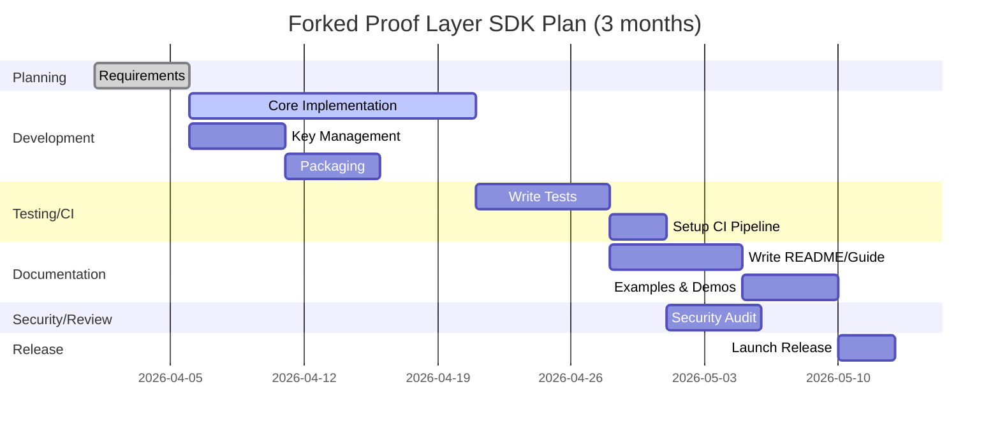
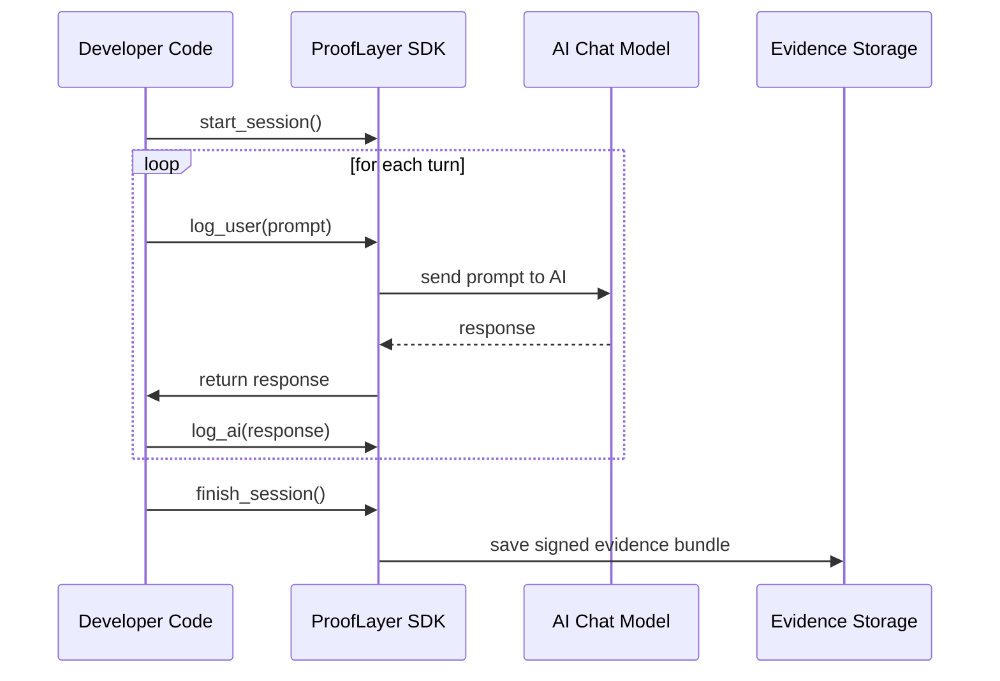

# Executive Summary: Lean Proof Layer SDK Fork for EU AI Act Chat Compliance

## Overview

We propose a lean **Proof Layer SDK** fork that retains only the essential components needed to integrate with chat systems and meet EU AI Act obligations. The existing repository is a large, multi-language monorepo (Rust/Python/TypeScript/JavaScript) with demos, documentation, and CI. The fork will remove non-essential surfaces and keep core runtime libraries and APIs for logging, evidencing, and management.

The forked SDK will focus on:

- built-in transcript logging (Article 12 record-keeping)
- automated proof generation
- human-in-the-loop hooks for oversight
- practical support for transparency, documentation, risk workflows, and incident handling

Estimated effort: **~3–4 months** (approximately **60–80 person-days**) to reach production readiness, including tests, security review, and developer documentation.

## Current Repository Structure (Snapshot)

The current `proof-layer-sdk` repository is organised as a full-stack monorepo. Core areas include:

- **Rust crates** under `crates/` (core proof engine plus wrappers, including `crates/pyo3/`)
- **Python SDK** under `packages/sdk-python/` (`proofsdk/`, decorators, CLI, packaging)
- **TypeScript SDK** under `sdks/typescript/` (parallel API for JavaScript/TypeScript environments)
- **Web demo** under `web-demo/` (React-based integration walkthrough)
- **Scripts and CI** under `scripts/` and `.github/workflows/`
- **Examples and documentation** spread across root/docs/example locations

In summary, the current repository is broader than a minimal compliance layer.

## EU AI Act Requirements (High-Risk Chat Systems)

For high-risk and related regulated AI usage in chat contexts, an implementation should account for:

- **Transparency** (Articles 50–52)
- **Automatic logging / record-keeping** (Article 12)
- **Technical documentation** (Article 11 + Annex IV)
- **Data governance** (Article 10)
- **Human oversight** (Article 14)
- **Risk management lifecycle** (Articles 9–10)
- **Conformity assessment readiness**
- **Incident reporting and post-market handling** (including Article 62 pathways)

## Feature-to-Obligation Mapping

A minimal Proof Layer surface can support these obligations through:

- **Tamper-evident runtime logs** for chat inputs/outputs (Article 12)
- **Provenance metadata** for transparency and auditability
- **Structured evidence bundles** to support Annex IV documentation packs
- **Oversight hooks** for human review or escalation policies
- **Incident reconstruction capability** through signed session evidence

## Minimal SDK Components and API

The proposed minimal SDK should include:

- **Core API** (`ProofLayer` or equivalent)
  - initialise session
  - `log_user(...)`
  - `log_ai(...)`
  - finalise session and produce bundle
- **Proof generation**
  - deterministic transcript hashing
  - signature over session proof root
- **Verification utility**
  - SDK function and/or CLI command
- **Key management tooling**
  - key generation and secure loading helpers
- **Error handling**
  - explicit failure paths when capture or signing fails
- **Minimal dependencies**
  - only required crypto/runtime libraries
- **Packaging**
  - npm package
  - PyPI package
  - optional Docker wrapper service

### Illustrative Python Usage

```python
from proofsdk import ProofLayer

proof = ProofLayer.load(private_key_path="keys/sign_key.pem")

user_msg = "List the EU AI Act transparency requirements."
proof.log_user(user_msg)
ai_response = llm.chat(user_msg)
proof.log_ai(ai_response)

bundle = proof.finish_session()
send_to_compliance_server(bundle)
```

### Illustrative TypeScript Usage

```ts
import { ProofLayer } from "proof-layer-sdk";

async function chatWithProof(userInput: string) {
  const proof = await ProofLayer.load("keys/sign_key.json");
  proof.logUser(userInput);
  const aiReply = await openai.chatCompletion(userInput);
  proof.logAI(aiReply);
  const bundle = await proof.finishSession();
  await sendProof(bundle);
}
```

## Proposed Fork Plan and Timeline

1. **Requirements and design** (~5 days)
2. **Core implementation** (~15–20 days)
3. **Key management tooling** (~5 days)
4. **Packaging and distribution** (~5 days)
5. **Testing and CI hardening** (~10 days)
6. **Documentation and migration guide** (~10 days)
7. **Security review** (~5 days)
8. **Release and feedback loop** (~5 days)



## Packaging and Distribution

- **Python** (`proof_layer_sdk`) via PyPI
- **TypeScript/JavaScript** (`proof-layer-sdk`) via npm
- **Optional Docker image** exposing proof APIs over HTTP for service-style integration

## Security and Privacy Considerations

- keep private signing keys out of source control
- support secure key loading from environment/KMS/HSM-compatible workflows
- enable optional redaction/masking for sensitive content before logging
- use widely vetted primitives (e.g. Ed25519 over transcript hash commitments)
- reduce dependency footprint and continuously scan dependencies

## Testing and CI

- unit tests: logging, bundle generation, verification, tamper detection
- integration tests: end-to-end chat capture flow
- CI: lint, test, coverage, packaging checks, release automation on tags
- optional fuzz/property testing for robustness

## Documentation Deliverables

- Getting Started guide
- API reference
- concise integration examples
- migration guide from broader SDK surface
- compliance mapping checklist for developers and auditors
- architecture overview diagrams

## Governance and Maintenance

- semantic versioning and clear release branches
- contributor guidelines, issue/PR templates, and review gates
- security reporting path and patch cadence
- explicit OSS licensing and maintainer ownership

## Current vs Proposed (Condensed)

| Area | Current SDK | Proposed Minimal SDK |
| --- | --- | --- |
| Surface | Multi-language, demos, broad tooling | Compliance-focused runtime and APIs |
| UI/Demo | Included | Removed from core fork |
| Logging/Proof | Present with broader abstractions | Core logging/signing only |
| Key tooling | Partial | Required, explicit |
| Dependencies | Broad | Minimized |
| CI/Testing | Present, mixed scope | Focused on critical assurance paths |
| Docs | Extensive mixed docs | concise integration + compliance guides |

## Reference Architecture

```mermaid
graph LR
    subgraph Chat Application
      User[User]
      ChatUI[Chat UI]
      AIModel[AI Model Service]
    end
    subgraph ProofLayer
      Capturer[ProofLayer SDK]
      KeyStore[Signing Keys\n(private/public)]
      BundleStore[Secure Log Storage]
    end
    User --> ChatUI
    ChatUI --> Capturer[Capture Hook]
    Capturer --> AIModel
    AIModel --> Capturer
    Capturer --> BundleStore
    Capturer -- key ops --> KeyStore
    ChatUI -.-> AIModel
```

## Integration Sequence



## Next Steps

Immediate actions:

1. finalise target language scope (Python only vs Python + TypeScript)
2. define the exact minimal API and JSON bundle schema
3. build a thin prototype in one SDK to validate ergonomics
4. lock packaging/release pipeline and migration documentation plan

This fork direction keeps only what is needed for verifiable, practical chat compliance workflows while reducing operational and maintenance complexity.
